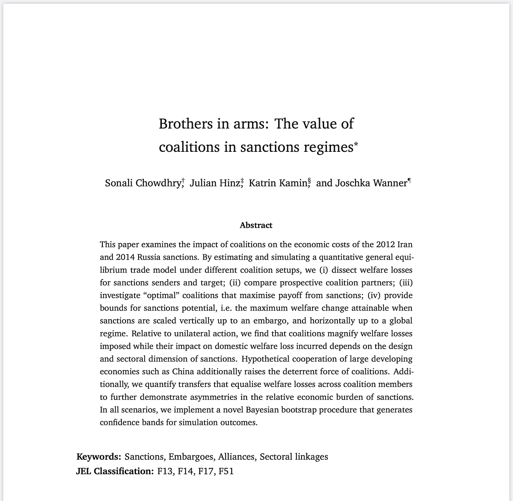

# Brothers in arms: The value of coalitions in sanctions regimes

Replication repository for the paper "Brothers in arms: The value of coalitions in sanctions regimes".

## Structure of the repository
The `code` folder contains all files necessary to create figures, tables and other statistics mentioned in the paper.

- `code/0-prepare-data.R` takes the raw data from the folder `input` and creates the main dataset to be used throughout the paper
- `code/1-estimate-estimate-sanctions-effect.R` performs the estimations for section 5 of the paper
- `code/2-simulate-counterfactuals.R` runs the simulations for section 6 of the paper
- `code/3-generate-output.R` generates the figures and maps from results of the gravity estimations and simulated counterfactuals

The `input` folder contains all necessary data.
- `input/metadata` contains metadata for GTAP and trade data
- `input/elasticities` contains trade elasticity estimates from Fontagné et al. (2020)
- `input/gdp_growth` contains GDP growth figures from the World Bank
- `input/gdp_ppp` contains GDP (ppp) figures
- `input/gravity` contains gravity covariates from USITC
- `input/kite_initial_conditions` contains initial conditions for the KITE model based on GTAP 10 data
- `input/oil_gas_services` contains data on trade in gas, oil, and services
- `input/trade` contains trade data sourced from CEPII's BACI dataset, aggregated to GTAP sectors

Note that the GTAP 10-based initial conditions for the [KITE model](https://github.com/julianhinz/KITE) cannot be provided publicly here. The data is available for purchase online [(http://gtap.agecon.purdue.edu)](http://gtap.agecon.purdue.edu) and we are happy to help converting those into the required initial conditions.

All results from data wrangling, regressions, and simulations are saved in `temp`.

Final generated outputs, like tables and figures, are saved in `output`.
